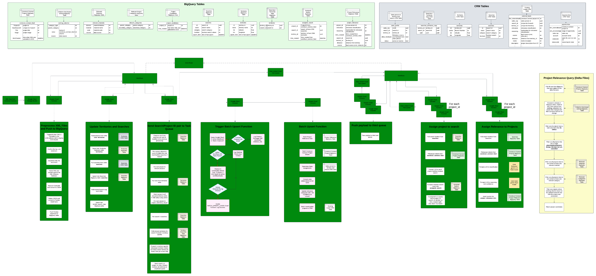

# Cloud Functions

This directory contains the source code for various Google Cloud Functions used in the FBM Sales Recommender project. Each function is designed to perform a specific task within the overall data processing and recommendation pipeline.

## Functions

Below is a list of the Cloud Functions in this directory, along with a brief description of their purpose:

- **assign_project_to_search.py**: Assigns relevant projects to searches.
- **assign_relevance.py**: Assigns a relevance score to project-search pairs.
- **backfill_projects.py**: Backfills historical projects and processes them.
- **batch_upsert_leads.py**: Upserts leads into the CRM system in batches.
- **config.py**: Contains configuration settings for the Cloud Functions.
- **data_intake.py**: Handles the intake of XML data, processes it, and loads it into BigQuery.
- **hist_xml_load.py**: Loads historical XML data into BigQuery.
- **logging_config.py**: Configures logging for the Cloud Functions.
- **main.py**: Contains the `send_projects_to_queue` function that identifies project candidates and sends them to a task queue for further processing. This is a central function that orchestrates part of the workflow.
- **reroute_to_search_or_relevance_queue.py**: Reroutes tasks to the appropriate queue (search or relevance) based on certain criteria.
- **search_territory_updates.py**: Updates search and territory data from Dynamics CRM to BigQuery.
- **send_relevent_project_to_queue.py**: Sends relevant projects to a queue for processing. (Note: This appears to be an older or alternative version of the functionality in `main.py`. Consider consolidating if they serve the same purpose).
- **split_large_xml_files.py**: Splits large XML files into smaller chunks for easier processing.
- **trigger_batch_upsert_lead_function.py**: Triggers the batch upsert lead function.
- **workflow_failure.py**: Handles failures in the workflow and logs relevant information.

## Structure

The directory is organized as follows:

- **`models/`**: Contains Pydantic models for data validation and serialization.
- **`services/`**: Includes modules for interacting with external services like BigQuery, Google Cloud Storage, Dynamics CRM, and Vertex AI.
- **`tests/`**: Contains unit and integration tests for the Cloud Functions.
- **`utils/`**: Provides utility functions shared across multiple Cloud Functions.
- **`.env` / `.env.DEV` / `.env.PROD`**: Environment-specific configuration files (ensure these are not committed to version control if they contain sensitive information).
- **`requirements.txt`**: Lists the Python dependencies for the Cloud Functions.

## Deployment

Cloud Functions are deployed using the `gcloud functions deploy` command. The `deploy/call_deploy_cloud_function.sh` script in the parent directory provides examples of how these functions are deployed. Each function is typically triggered by an HTTP request.

## Local Testing

Many of the Cloud Functions include a `if __name__ == "__main__":` block or have corresponding test files in the `tests/` directory to facilitate local testing and development.

## Key Concepts

- **`functions_framework`**: The library used to write HTTP-triggered Cloud Functions in Python.
- **BigQuery**: Used as the primary data warehouse for storing project data, search criteria, and relevance scores.
- **Google Cloud Storage (GCS)**: Used for storing raw XML files and temporary data.
- **Google Cloud Tasks**: Used for asynchronous task processing and managing workflows.
- **Dynamics CRM**: The source for territory and search data.
- **Vertex AI**: Used for machine learning model predictions (e.g., relevance scoring).
- **Logging**: Centralized logging is implemented using `logging_config.py` which integrates with Google Cloud Logging.

## Environment Variables

The Cloud Functions rely on environment variables for configuration. These are typically set during deployment and can be managed using `.env` files for local development. Refer to `config.py` and the individual function files for specific environment variables required.

## Note

This README provides a general overview. For detailed information on a specific function, refer to the comments and code within the respective Python file.
