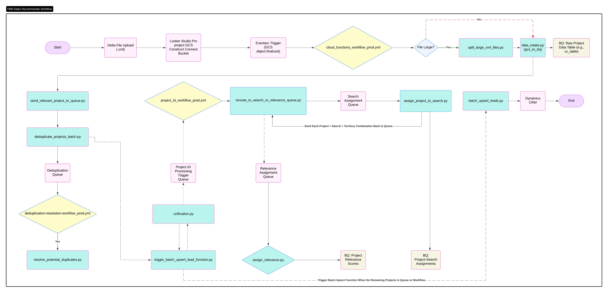
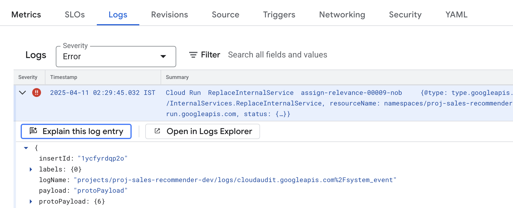
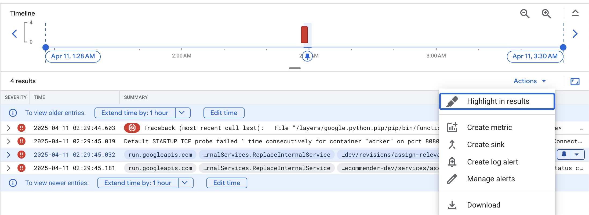

# FBM Sales Recommender

## Overview

The FBM Sales Recommender project is a comprehensive system designed to process sales-related data, identify relevant project opportunities, assign them to appropriate searches or sales initiatives, and synchronize this information with CRM systems. It leverages various Google Cloud Platform (GCP) services, machine learning capabilities, and automated workflows to streamline sales processes.



## Repository Structure

The repository is organized into several key directories:

-   **`bigquery/`**: Contains scripts and configurations for setting up and managing BigQuery datasets, tables, and views. This includes DDL scripts, schema definitions, and static data files.
-   **`CloudFunction/`**: Houses the source code for various Google Cloud Functions that perform specific tasks like data intake, project assignment, relevance scoring, and CRM integration.
-   **`deploy/`**: Includes scripts for deploying various components of the system, such as Cloud Functions, Cloud Tasks, Pub/Sub topics, and storage notifications.
-   **`EDA/`**: Contains notebooks for Exploratory Data Analysis.
-   **`Python/`**: Includes utility Python scripts for ad-hoc tasks, batch processing, and triggering workflows (e.g., CRM sync, historical data processing).
-   **`terraform/`**: Contains Terraform configurations for managing the project's infrastructure as code, with separate environments for development (`dev`) and production (`prod`).
-   **`TuningPipeline/`**: Includes files related to Vertex AI model tuning pipelines, such as Dockerfile, Python scripts, and YAML configurations.
-   **`workflow/`**: Contains definitions for Google Cloud Workflows (e.g., `cloud_functions_workflow_*.yml`, `project_id_workflow_*.yml`) and documentation on how they are triggered, often by GCS events via Eventarc.
-   **`.github/workflows/`**: Contains GitHub Actions workflow definitions for CI/CD, as detailed in the "CI/CD Pipelines (GitHub Actions)" section.

## Core Components & Technologies

### Google Cloud Platform (GCP)

-   **BigQuery**: Serves as the central data warehouse for storing project data, search criteria, relevance scores, and logs. Managed via scripts in the `bigquery/` directory.
-   **Cloud Functions**: Used for serverless, event-driven processing. Functions handle tasks like XML data intake from GCS, assigning projects to searches, calculating relevance, and interacting with Dynamics CRM. Source code is in `CloudFunction/`.
-   **Cloud Workflows & Eventarc**: Orchestrate sequences of operations, often triggered by events like file uploads to Google Cloud Storage (GCS) via Eventarc. Workflow definitions are in the `workflow/` directory.
-   **Vertex AI & Tuning Pipeline**: Leveraged for machine learning model training, tuning, and predictions (e.g., relevance scoring). The `TuningPipeline/` directory supports these processes.
-   **Google Cloud Storage (GCS)**: Used for storing raw input files (e.g., XMLs), temporary data, and static files for BigQuery loading.
-   **Cloud Tasks**: Manages asynchronous task execution, allowing for decoupling of processes and handling of background jobs.
-   **Pub/Sub**: Provides messaging services for event-driven architectures and communication between components.

### Infrastructure & CI/CD

-   **Terraform**: Used for defining and provisioning GCP infrastructure as code, ensuring consistency across environments. Configurations are in `terraform/`.
-   **GitHub Actions**: Automate CI/CD pipelines for deploying and managing various components (BigQuery, Cloud Functions, Workflows, etc.) across `dev` and `prod` environments.

### Data Sources & Sinks

-   **Dynamics CRM**: Acts as a key system for lead and opportunity management. Scripts and Cloud Functions interact with CRM to synchronize project relevance data.

### Development

-   **Python**: The primary programming language used for Cloud Functions, data processing scripts, and utility tools.

## Key Workflows & Processes

-   **Data Intake**: Large XML files are often split, processed by Cloud Functions (e.g., `data_intake.py`, `hist_xml_load.py`), and their content is loaded into BigQuery. This process can be triggered by file uploads to GCS.
-   **Project Relevance and Assignment**: Projects are evaluated for relevance against search criteria or sales initiatives. Cloud Functions like `assign_project_to_search.py` and `assign_relevance.py` handle these tasks, often utilizing models deployed on Vertex AI.
-   **CRM Synchronization**: Project relevance data, leads, and opportunities are synchronized between BigQuery and Dynamics CRM using scripts like `Python/sync_project_relevance_crm.py` and Cloud Functions like `batch_upsert_leads.py`.
-   **Historical Data Processing**: Scripts and Cloud Functions (e.g., `Python/trigger_CF_hist_data.py`, `CloudFunction/backfill_projects.py`) are used to process and backfill historical project data.

## CI/CD Pipelines (GitHub Actions)

The project utilizes GitHub Actions for automated deployments and infrastructure management. The `.github/workflows` folder contains key pipelines that manage various parts of the infrastructure and services. These pipelines exist in both the `dev` and `main` branches.

Key pipelines include:

-   **`bigquery-pipeline.yml`**: Manages BigQuery datasets and configurations associated with `dev` and `prod` environments.
-   **`cloud-tasks.yml`**: Deploys Cloud Task queues in `dev` and `prod` environments.
-   **`cloud-workflow.yml`**: Deploys Google Cloud Workflows in `dev` and `prod` environments.
-   **`cloudfunction-pipeline.yml`**: Automates the deployment of Google Cloud Functions in `dev` and `prod` environments.
-   **`pubsub-workflow.yml`**: Manages Pub/Sub topics and their deployment in `dev` and `prod` environments.
-   **`storage-notifications-workflow.yml`**: Automates the creation of GCS bucket notifications in `dev` and `prod` environments.
-   **`vertexai-pipeline.yml`**: Deploys pipelines to Vertex AI in `dev` and `prod` environments.
-   **`terraform-infra-pipeline.yml`**: Manages Terraform infrastructure deployment and updates for both `dev` and `prod` environments.

### How the Pipelines Work

1.  **Triggering the Workflow**:
    *   Pipelines are typically triggered manually through the `workflow_dispatch` event.
    *   When starting a workflow, a user is prompted to choose between two environments: `dev` or `prod`. This choice sets up the environment-specific configurations.

2.  **Branching Strategy for Deployments**:
    *   Deployments to the `dev` environment should use the `dev` branch. When triggering a pipeline for `dev`, select the `dev` branch and the `dev` environment.
    *   Deployments to the `prod` environment should use the `main` branch. When triggering a pipeline for `prod`, select the `main` branch and the `prod` environment.

3.  **Pipeline Steps**:
    *   **Checkout Code**: The repository's code is checked out using the `actions/checkout@v2` action.
    *   **Authenticate to Google Cloud**: The pipeline authenticates to Google Cloud using the `google-github-actions/auth@v2` action, utilizing the `GOOGLE_CREDENTIALS` secret.
    *   **Set Up Google Cloud SDK**: The Google Cloud SDK is set up, and the project ID is configured using `google-github-actions/setup-gcloud@v2`.
    *   **Running Shell Commands**: Subsequent steps execute shell scripts or commands to deploy the respective services.

4.  **Manual Approval for Production Deployments**:
    *   Production deployments require manual approval.
    *   To approve, navigate to the specific deployment in GitHub Actions and click on the "Review deployments" button.
    *   Choose the `production` environment. Approvers designated in the environment’s protection rules will be notified.
    *   Only those with approval rights can approve and complete the deployment to production.
    *   Approvers can be managed in GitHub repository settings under `Settings > Environments > [environment_name]`.

## Setup & Deployment

### General Prerequisites

-   A configured Google Cloud Project.
-   **GitHub Secrets and Environment Variables**:
    *   `GOOGLE_CREDENTIALS`: Google Cloud service account key with necessary permissions, stored as a GitHub Secret.
    *   `GCP_PROJECT_ID`: The Google Cloud project ID, set as a GitHub environment variable for `dev` and `prod` environments.
    *   `REGION`: The Google Cloud region (e.g., `us-central1`), set as a GitHub environment variable for `dev` and `prod` environments.
    *   These variables can be managed under `Settings > Secrets and variables > Actions` and `Settings > Environments` in the GitHub repository.

### Component-Specific Setup

-   **BigQuery**: Use scripts in `bigquery/` (e.g., `dev.sh`, `prod.sh`) to create datasets, tables, views, and load static data.
    ```bash
    # Example for dev
    cd bigquery
    export ENV=dev
    pip install -r requirements.txt
    ./dev.sh
    ```
-   **Cloud Functions**: Deployed using `gcloud functions deploy`. The `deploy/call_deploy_cloud_function.sh` script provides examples. Refer to `CloudFunction/README.md` for more details.
-   **Cloud Workflows**: Deployed as part of the CI/CD pipelines or manually using `gcloud workflows deploy`.
-   **Terraform**: Apply configurations from the `terraform/` directory for the respective environment.
    ```bash
    # Example for dev
    cd terraform/dev
    terraform init
    terraform apply
    ```

## Monitoring & Alerting

Proactive monitoring and alerting are set up in the production environment in GCP to ensure system health and timely incident response.

### Configured Alerts

-   Alerts are primarily configured for **Cloud Functions** and **Cloud Workflows**, which are critical for the pipeline's successful execution. These alerts cover various statuses and potential issues.

### Notification Channels

-   **Email Notifications**: Email is the primary channel for alert notifications.
-   **Adding New Email Recipients**:
    1.  Navigate to "Monitoring > Alerting" in the GCP Console for the production project (e.g., `https://console.cloud.google.com/monitoring/alerting?project=proj-sales-recommender-prod`).
    2.  Click on "Edit notification channels."
    3.  Under the "Email" section, click "Add New" and enter the email address. Save the channel.
    4.  To add this new email to an existing alert policy:
        *   Click on the alert policy you wish to modify.
        *   Select "Edit."
        *   Proceed to the "Notifications and Name" step (or similar, the UI may vary).
        *   In the "Notification Channels" dropdown, select the checkbox for the newly added email address.
        *   Save the alert policy.

### Log-Based Alert Setup

You can create alerts based on specific log messages, which is useful for getting notified about particular error patterns.

1.  **Navigate to Logs Explorer**:
    *   Go to the logs of the service for which you want to create an alert (e.g., a specific Cloud Function).
    *   Find a log entry that represents the condition you want to be alerted on.
    *   Click on the options for that log entry and select "Open in Logs Explorer" or a similar option.



2.  **Create Alert from Log Query**:
    *   Once the log is open in Logs Explorer and you have refined your query to isolate the desired logs, click on the "Actions" button (or a similar menu).
    *   Select "Create log alert" or "Create alert from query."



3.  **Configure Alert Policy**:
    *   A pop-up or new page will appear to configure the alert policy.
    *   Fill in the alert name, notification frequency, and other conditions.
    *   Select the notification channels (e.g., the email channel you configured earlier).
    *   Save the alert policy.

## Local Development & Testing

-   Many Cloud Functions in `CloudFunction/` include `if __name__ == "__main__":` blocks for local execution and testing.
-   Unit and integration tests are typically located in `tests/` subdirectories within components like `CloudFunction/`.

## Scripts

The `Python/` directory contains various scripts for operational tasks:

-   **`sync_project_relevance_crm.py`**: Synchronizes project relevance data with Dynamics CRM.
-   **`trigger_CF_hist_data.py`**: Triggers Cloud Functions for historical data loading.
-   **`trigger_backfill_projects.py`**: Initiates the project backfilling process.
-   **`trigger_project_id_workflow.py`**: Triggers workflows for specific project IDs.

Consult the `Python/README.md` and individual script comments for detailed usage.