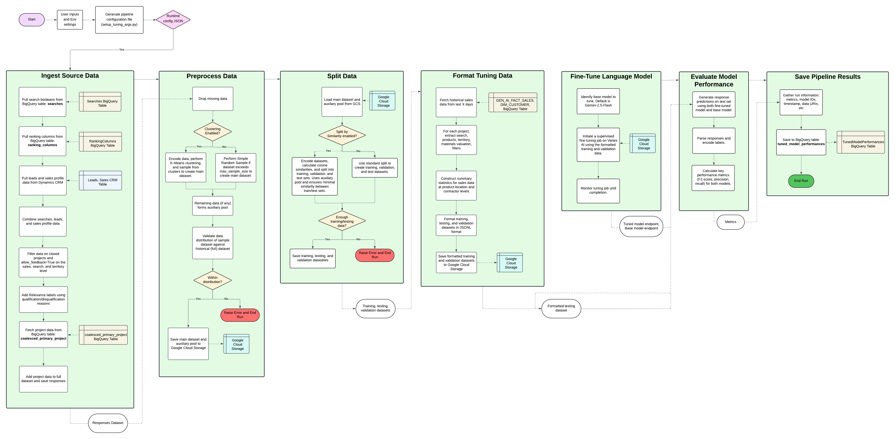

# Fine-tuning with Vertex AI Pipelines 

This pipeline is designed to fine-tune the base Gemini 2.5 Flash model using Vertex AI Supervised Fine Tuning and feedback actions from the FBM CRM Leads table. Information on how to manually deploy the Pipeline to Vertex AI in `dev` and `prod` environments, using GitHub actions, can be found [here](../Pipeline-Readme.md), using the YAML file [here](../.github/workflows/vertex-ai-pipeline.yml). 



## Folder Structure

```
.
├── Dockerfile                      # Docker configuration 
├── components                      # Contains Kubeflow components
│   ├── _compile_components.py
│   ├── evaluate_model.py
│   ├── format_tuning_data.py
│   ├── ingest_data.py
│   ├── preprocess_data.py
│   ├── split_data.py
│   ├── save_outputs.py
│   ├── tune_model.py
├── configs                         # Saved configurations 
│   └── dev_a_4_e_10.json
├── requirements.txt                
├── relevance_prompt.txt            # LLM prompt for project relevancy 
├── relevance_prompt_examples.txt   # Labeled project data for few-shot prompting 
├── run_tuning_pipeline_dev.sh      # Shell script to run the dev pipeline 
├── run_tuning_pipeline_prod.sh     # Shell script to run the prod pipeline
├── setup_tuning_args.py            # Load environment args and create configs
├── tests                           # Testing components locally 
│   ├── create_test_data.py         # Script for fetching data for local tests
│   ├── test_evaluate_model.py
│   ├── test_format_tuning_data.py
│   ├── test_ingest_data.py
│   ├── test_preprocess_data.py
│   ├── test_split_data.py
│   └── test_utils.py
├── .env.DEV                        # dev environment vars
├── .env.PROD                       # prod environment vars
├── tuning_pipeline.py              # Main pipeline 
└── utils.py                        # Utility functions 
```

## Components 

Below is a list of the Kubeflow components in the `components/` folder, as well as brief descriptions:

1. **Ingest Data** (`ingest_data.py`): This ingests all necessary data for tuning:
    - Relevant materials, categories, rankings, and searches from BigQuery
    - Leads from CRM tables 
    - ConstructConnect and Dodge project data from BigQuery 

2. **Preprocess Data** (`preprocess_data.py`): 
    - Cleans and preprocesses data. 
    - Splits data into main data and auxilary data. Auxilary data may be used later in the pipeline. Split is either done using a simple random sample or using K-means clustering followed by sampling from clusters.
    - Checks distribution of sample data to original data. This ensures that the sample is representative of the overall data. 

3. **Split Data** (`split_data.py`): 
    - Splits data into testing, training, and validation datasets. 
        - Split is either done by: 
            - Standard Sklearn Split 
            - Similarity Split: use cosine similiarity to split training/testing datasets to ensure datasets are not too similar. Iteratively removes similar rows and adds auxiliary data from `preprocess_data` to create new test sets. 

3. **Format Tuning Data** (`format_tuning_data.py`): 
    - Fetches historical sales data from CRM and BigQuery (Looker-Studio-Pro project). 
    - Formats training/validation/testing datasets according to specified JSONL schema for fine-tuning. Uses LLM relevance prompt, sales data, product categories, and project data. 

4. **Tune LLM model** (`tune_model.py`): Submits a tuning job using training/validation datasets with base model defaulting to Gemini 2.5 Flash. Returns the tuned model endpoint for further evaluation. 

5. **Evaluate Base and Tuned Model Performances** (`evaluate_model.py`): Formats testing data, makes predictions on relevancy classification with the base and tuned model, and generates performance metrics (F1 score, accuracy, precision). 

6. **Save Outputs to BigQuery** (`save_outputs.py`): Saves pipeline outputs to BigQuery for further analysis. Includes model endpoints, pipeline run, and performance metrics. 

## Pipeline 
The pipeline in `tuning_pipeline.py` specifies the orchestration of Kubeflow components and data flow. This file reads arguments passed in from a configuration file, loads components, and submits a Vertex AI Pipeline job. 

## Setup for Local Development
1. Navigate to directory: `cd TuningPipeline/`
2. Install requirements: `pip install -r requirements.txt` 
3. Setup Google Application Credentials and ensure access to the project. 
4. Copy Dynamics Manager file from `CloudFunction/` folder: 
```
cp ../CloudFunction/services/dynamics_manager.py ./dynamics_manager.py
```
5. Specify environment file: `export ENV_FILE=.env.DEV` or `export ENV_FILE=.env.PROD`

## Local Testing 
Files for locally testing individual Kubeflow components without kicking off a Vertex AI pipeline within GCP can be found in `tests/`. This includes pytest files and a script for creating test data. 

To run, first download the service account JSON key from GCP and place in the `TuningPipeline/` folder under `dev_key.json` or `prod.key.json`. This is for interacting with BigQuery and other GCP services. Each test will first authenticate with these credentials before starting the test. 

Then run: 
```
python tests/create_test_data.py 
pytest  -s --log-cli-level=INFO  tests/<TEST_FILE> 
``` 

Note: `test_utils.py` is used for creating Input/Output Artifacts specific to Kubeflow Pipelines. This allows passing of test data into a component/saving output data locally, mimicking how data would be passed in Vertex AI. See this link for more info: https://www.kubeflow.org/docs/components/pipelines/user-guides/data-handling/artifacts/

## Running Pipelines in GCP From Terminal

**See `run_tuning_pipeline_dev.sh` for overview of how the entire pipeline is run using GitHub actions. To kick off a pipeline from terminal, used for developmental purposes, see below.**

### Configuration Setup 

Environment variables are given in `.env.DEV` and `.env.PROD`. Other variables are configured in `setup_tuning_args.py`. This generates a configuration file that is used as input to the pipeline. 

Run this command to set up arguments and note the configuration location.  

```
python setup_tuning_args.py
``` 

### Create Dockerfile Image
A Dockerfile image in Artifact Registry is required to package up dependencies (`requirements.txt`), utility functions (`utils.py`), and the Dynamics Manager (`dynamics_manager.py`) for use by Kubeflow Components. **If files included in the Docker image are modified, you must rebuild and push this image before running the pipeline in GCP.** While local tests will reflect these changes without immediate rebuild, its essential to always update the Docker image in the registry whenever such code changes are pushed. This ensures Vertex AI pipelines execute with the correct versions. 

```
docker build -t <LOCATION-docker.pkg.dev/PROJECT_ID/REPOSITORY/IMAGE_NAME>:latest . 
docker push <LOCATION-docker.pkg.dev/PROJECT_ID/REPOSITORY/IMAGE_NAME>
```

### Compiling Components 
Components must be compiled into YAML files to be used by the pipeline. **Any time a change is made to a component's Python file in the `components/` directory, it must be re-compiled before submitting a pipeline job to GCP from terminal.** However, local test scripts directly import and run the Python component code, so re-compiling is not necessary for local testing. 

```
python components/_compile_components.py <LOCATION-docker.pkg.dev/PROJECT_ID/REPOSITORY/IMAGE_NAME:latest>
```

### Pipeline Execution 
A pipeline can be executed from terminal using a service account and previously generated configuration file. 

Optionally pass in the -testing flag as True/False to enable testing. This will fetch already labeled project data from GCS and skip running a full tuning job, instead returning an already tuned model endpoint. Defaults to False. 

```
python tuning_pipeline.py -c <PATH/TO/CONFIG/FILE> -a <SERVICE_ACCOUNT> -t <True/False>
``` 

This will display a link that shows the pipeline execution in the Google Cloud Console.
